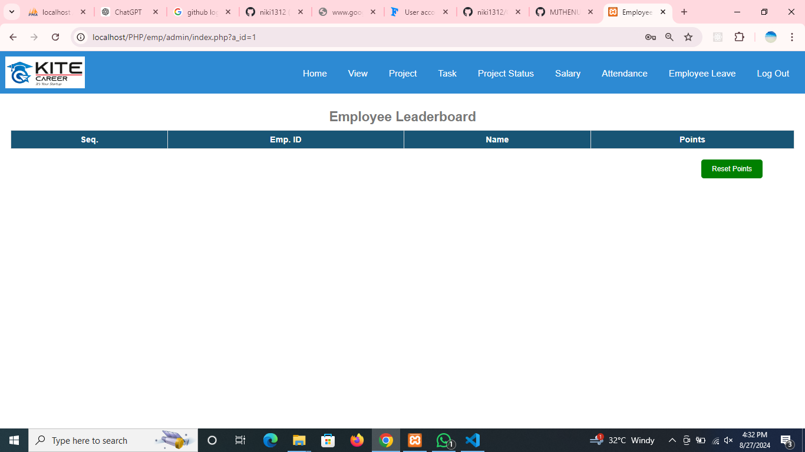
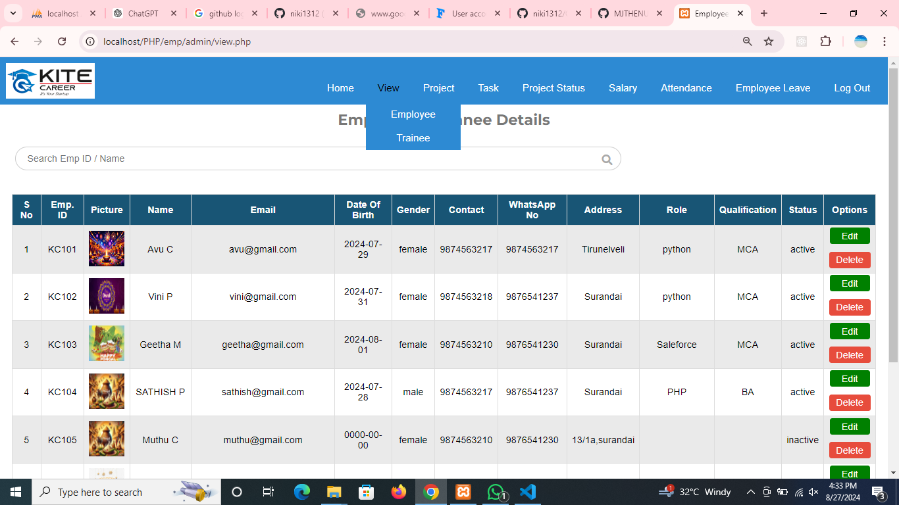
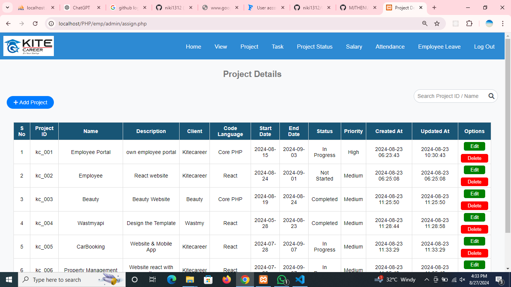
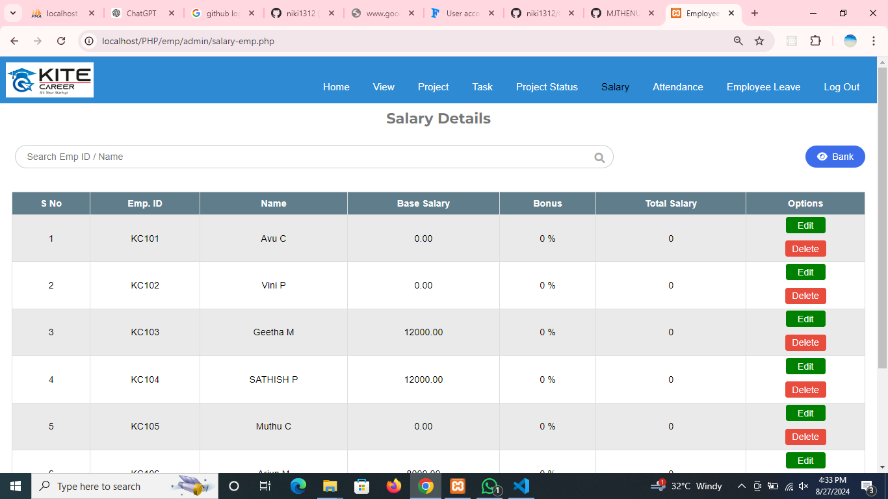
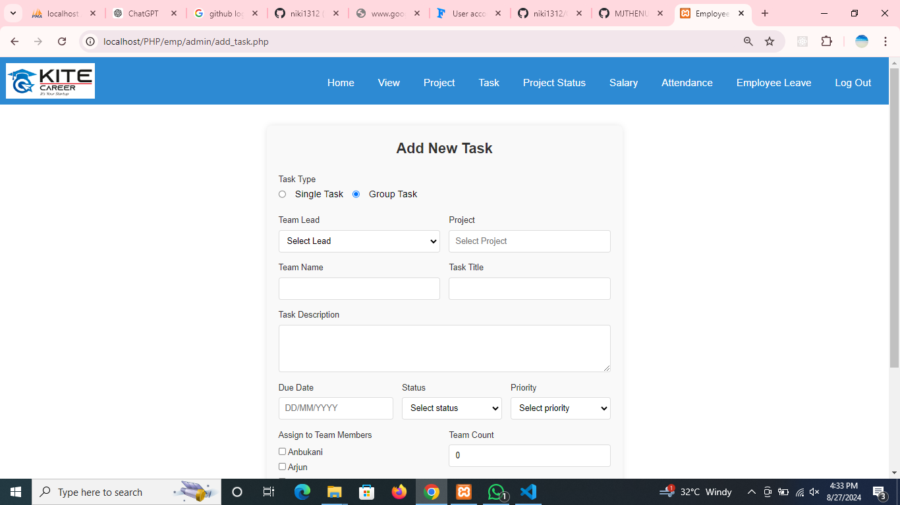
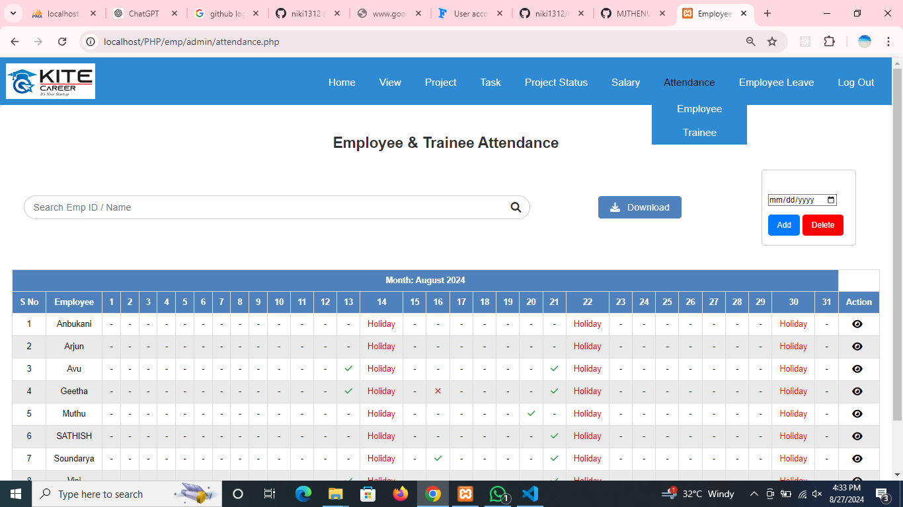

Follow the Steps
    1.Download the (.zip fil)/https://github.com/MJTHENU/EMS.git
    2.this folder move to (xammapp-->htdocs-->paste)
    Results:  http://localhost/PHP/emp/index.php

Screenshots

<video width="600" controls>
  <source src="./screenshot/Employeee Management - Google Chrome 2024-08-27 16-27-52.mp4" type="video/mp4">
  Your browser does not support the
</video>